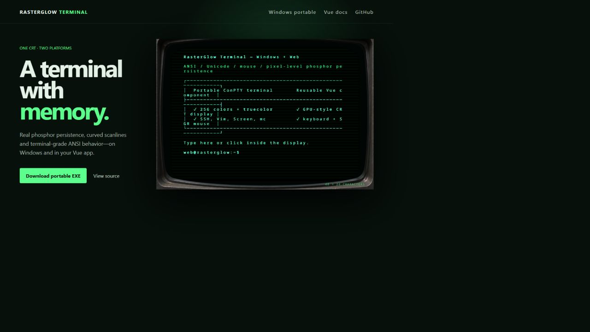

# RasterGlow Terminal

**A real CRT terminal for Windows and the web.** Run the portable Windows terminal with ConPTY, or embed the same WebGL phosphor display as a Vue 3 component.

[](https://github.com/thomasliebig/rasterglow-terminal/releases/latest)
[](https://thomasliebig.github.io/rasterglow-terminal/)
[](https://github.com/thomasliebig/rasterglow-terminal/actions/workflows/build.yml)
[](LICENSE)

[Try the web demo](https://thomasliebig.github.io/rasterglow-terminal/) · [Download the portable Windows EXE](https://github.com/thomasliebig/rasterglow-terminal/releases/latest) · [Embed it in Vue](#use-in-a-vue-3-project)

[](https://thomasliebig.github.io/rasterglow-terminal/)

RasterGlow combines an actual Windows terminal emulator with a reusable browser renderer. It supports ANSI/VT sequences, Unicode, terminal mouse input and interactive applications while reproducing curved scanlines, flicker, glow and **pixel-level phosphor persistence** on the GPU.

> The portable application is not an installer: download one EXE and run it. The browser component only renders and handles terminal I/O; connect it to a PTY/WebSocket backend when you need a real remote shell.

## Why RasterGlow?

| Capability | Windows portable | Web / Vue 3 |
| --- | :---: | :---: |
| Real terminal session | ConPTY + PowerShell | Connect your own PTY backend |
| ANSI, 256 colors and truecolor | ✓ | ✓ |
| Unicode and box-drawing glyphs | ✓ | ✓ |
| Keyboard and SGR mouse input | ✓ | ✓ |
| WebGL CRT curvature and curved scanlines | ✓ | ✓ |
| Pixel-level phosphor afterglow | ✓ | ✓ |
| Installation required | No | No |

The original desktop work was inspired by [cool-retro-term](https://github.com/Swordfish90/cool-retro-term), but RasterGlow is a separate implementation designed around Windows ConPTY and a portable Vue/WebGL renderer.

## Windows: download and run

1. Open the [latest release](https://github.com/thomasliebig/rasterglow-terminal/releases/latest).
2. Download `RasterGlow-Terminal-Windows-x64-Portable-v1.0.0.exe`.
3. Run it directly. No installation is required.

PowerShell, SSH, Vim, GNU Screen, Midnight Commander and full-screen TUI applications run inside the terminal. Press `F2` to show the CRT controls.

## Use in a Vue 3 project

```bash
npm install @thomasliebig/rasterglow-terminal-vue
```

```vue
<script setup lang="ts">
import { ref } from 'vue'
import { RasterGlowTerminal } from '@thomasliebig/rasterglow-terminal-vue'
import '@thomasliebig/rasterglow-terminal-vue/style.css'

const terminal = ref<InstanceType<typeof RasterGlowTerminal>>()

function sendToBackend(data: string) {
  socket.send(data)
}

socket.addEventListener('message', event => {
  terminal.value?.write(String(event.data))
})
</script>

<template>
  <RasterGlowTerminal
    ref="terminal"
    aria-label="CRT web terminal"
    @data="sendToBackend"
    @resize="({ cols, rows }) => socket.send(JSON.stringify({ cols, rows }))"
  />
</template>
```

The component emits terminal input; it never exposes a browser user's local shell. A backend can bridge its input/output to a PTY, SSH session, container or demo process over WebSocket.

## Features

- Portable Windows x64 terminal powered by Electron and ConPTY
- Reusable Vue 3 terminal component and standalone WebGL renderer
- ANSI/VT parsing, 16/256 colors and 24-bit truecolor mapped to readable monochrome phosphor levels
- Unicode monospace rendering, box drawing, Braille and wide-character handling
- SGR mouse reporting, keyboard input, alternate screen, cursor styles, blink and text attributes
- Curved CRT geometry, scanlines, bloom, focus, brightness, contrast, noise and horizontal flicker
- Efficient GPU-based, per-pixel phosphor persistence rather than line-based trails
- Responsive character grid with exact column/row reporting

## Web demo

The [live demo](https://thomasliebig.github.io/rasterglow-terminal/) runs an interactive xterm-style showcase in the browser: ANSI colors, Unicode, box drawing, mouse coordinates, alternate-screen updates, flicker and phosphor afterglow. It does not connect to a system shell.

## Development

```bash
npm install
npm run dev
npm run build
```

The production build creates both the GitHub Pages demo and the distributable Vue library.

## Project status and provenance

RasterGlow Terminal is **vibe-coded with AI assistance** and has been iteratively tested and corrected against real Windows terminal applications. Please report rendering or compatibility failures with the program, terminal size and a screenshot or minimal reproduction.

This project reuses open-source packages under their respective licenses. See [THIRD_PARTY_NOTICES.md](THIRD_PARTY_NOTICES.md) for attribution. No source code from cool-retro-term is included.

## FAQ

### Is RasterGlow a real Windows terminal emulator?

Yes. The portable desktop build hosts a Windows ConPTY session rather than drawing a fake command prompt.

### Can I use RasterGlow as a web terminal?

Yes. The Vue component handles rendering and input. Connect it to a server-side PTY over WebSocket for an interactive shell, or feed it ANSI output for a safe demo.

### Does it support SSH, Vim, Screen, Midnight Commander and mouse input?

The Windows build supports interactive terminal applications, alternate-screen mode, terminal capabilities and SGR mouse packets. Compatibility reports are welcome because terminal applications exercise different VT behavior.

### Why is the display monochrome green if applications output colors?

RasterGlow preserves color distinctions as perceptual phosphor brightness levels. Brightness and contrast controls determine how strongly those levels differ while retaining the monochrome CRT character.

## Acknowledgements

- [xterm.js](https://github.com/xtermjs/xterm.js) and `@xterm/headless` for terminal parsing
- [node-pty](https://github.com/microsoft/node-pty) for Windows ConPTY integration
- [Electron](https://github.com/electron/electron) for the portable desktop shell
- [Noto Sans Mono](https://github.com/notofonts/latin-greek-cyrillic) for broad monospaced Unicode coverage
- [cool-retro-term](https://github.com/Swordfish90/cool-retro-term) for inspiration and for showing how much personality a terminal can have

## License

RasterGlow Terminal is released under the [MIT License](LICENSE). Bundled dependencies and fonts retain their own licenses; see [THIRD_PARTY_NOTICES.md](THIRD_PARTY_NOTICES.md).
